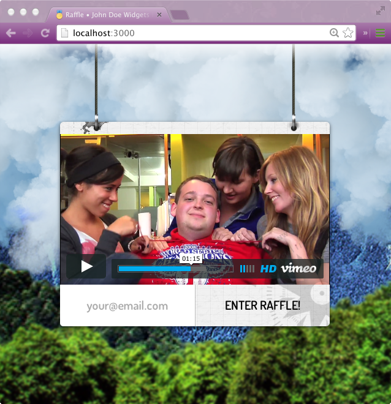
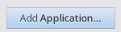
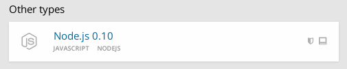
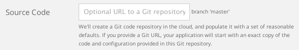
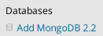
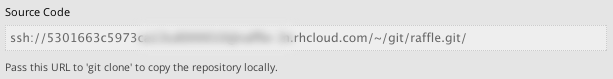

# Raffle

A graffically [sic] intense raffle/newsletter signup form single-page app. [Live demo](http://dave-3n.rhcloud.com).

Essentially a mashup of these other great projects:

* http://wagerfield.github.io/parallax
* https://github.com/petecoop/generator-express
* http://www.mrdoob.com/lab/javascript/webgl/clouds

It's setup for deployment to <https://www.openshift.com> with cartridges:

* Node.js 0.10
* MongoDB 2.2

## Getting started

### Using the Web GUI

Log into your OpenShift account and click the "Add Application..." button.

Scroll down to the "Other types" section and choose "Node.js 0.10".

On the next page, paste this repo's git URL into the "Source Code" input box.

    https://github.com/leoj3n/raffle.git

Once the application has been created, click "Add MongoDB 2.2".

When that finishes, use `git clone` to clone the repository to your local computer.

### Installing dependencies

From the project root...

Run the command `npm install` to get the local npm dependencies. This requires you have [Node.js](http://nodejs.org) installed. Npm dependencies are defined in [package.json](package.json) and are installed to a `node_modules` directory.

Next, get the local Bower dependencies with the command `bower install`. This requires you have [Bower](http://bower.io) installed. Bower dependencies are defined in [bower.json](bower.json) and are installed to `public/components`.

Both `node_modules` and `public/components` are ignored by [.gitignore](.gitignore), along with `.sass-cache`.

### Running the app

Edit `config/content.js`, adding your SMTP email host and username.

Edit `env.json` to contain your  app's name (as entered during the "Add Application..." step) and SMTP email password like so:

    {
      "APP_NAME": "raffle",
      "NODE_EMAIL_PASS": "charliebrown"
    }

This file is picked up by Grunt to emulate server environment variables.

Make sure [MongoDB](http://www.mongodb.org) is running. On Mac OS X, I simply start a new shell in my terminal and run `mongod`. It might be different for you depending on your setup.

Run `grunt` on the command line from the project root. This will start the node server as well as a watch server that live reloads your webpage when you save changes to a file. Also, Sass is compiled into `public/css`. Of course you must have installed [Sass](http://sass-lang.com) beforehand.

Open `localhost:3000` in your favorite browser. Enter an email address and submit the form. If your SMTP information is correct, an email should be sent from your configured email to the submitted email.

A listing of submitted emails can be viewed by visiting the special URL `localhost:3000/list?pass=<your-email-pass>`. You should probably impliment some kind of HTTPS authentication in production.

## Deploying

Edit `.openshift/action_hooks/pre_start_nodejs-0.10` so the line

    export NODE_EMAIL_PASS="<your-email-pass>"

contains the same password as `env.json`. In this same file there is `NODE_ENV`, a common variable used by Node to know whether it's running under development or production. Variables set in this file only affect the server.

Run `grunt dist`. This task compresses and optimizes assets into `dist/`.

Save all open files and commit all changes using `git commit`.

Now run `git push` to push your changes to the server. When that finishes (it might take a minute or two), visit your new app's domain to see a version of your app running live!

If everything is configured properly, confirmation emails should be sent when someone submits the email form. Submitted email handles should be logged in the database, viewable like they were on local by visitng `yourapp-yourdomain.rhcloud.com/list?pass=<your-email-pass>`.

## Mac OS X software installation tips

### MongoDB

Check out [Homebrew](http://brew.sh) if you're using Mac OS X. It's a package manager that allows installing and/or building CLI binaries like MongoDB by running a single command, f.ex:

    brew install mongodb

Installing Homebrew is easy:

    ruby -e "$(curl -fsSL https://raw.github.com/Homebrew/homebrew/go/install)"

### Node.js

Node can be installed using stock Homebrew but there are potential issues with that method (esp. concerning upgrades). A better method is using Homebrew's sister project [Homebrew Cask](http://caskroom.io), which installs Mac OS X _apps_ (.pkg and .dmg). It depends on Homebrew so you have to install that first before "tapping" the sister project:

    brew tap phinze/homebrew-cask && brew install brew-cask

Once tapped, install Node with:

    brew cask install node

### Bower

Once you have Node and npm (comes with Node), install Bower globally using the command `npm install -g bower`. It's a tool you'll be using a lot more of as your front-end career progresses, so you'll want to have it always readily available.

### Grunt

You should also install Grunt globally: `npm install -g grunt-cli`

### Sass

[Sass](http://sass-lang.com) is a great frontend language and is very easy to install because Ruby comes preinstalled on Mac OS X. Run `gem install sass`.

### RHC Client Tools

If you've graduated the OpenShift web GUI, or need to perform some special operation outside of git and SSH, you should check out the [RHC Client Tools](https://www.openshift.com/developers/rhc-client-tools-install).

